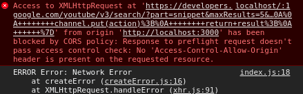

This project was bootstrapped with [Create React App](https://github.com/facebook/create-react-app). And created to fulfill  You.i TV exercise as part of its admission process. In order to run this project, run the following commands in the directory:
```
yarn install
yarn start
```


## Limited

It seems to be a problem regarding YoutTube API with CORS requests: it blocks them, so I was not able to fetch any request from them. Although, this project still is able to play/pause any given video given its url and has the whole infrastructure to work properly if the API eventually accepts CORS.

Evidence: 



